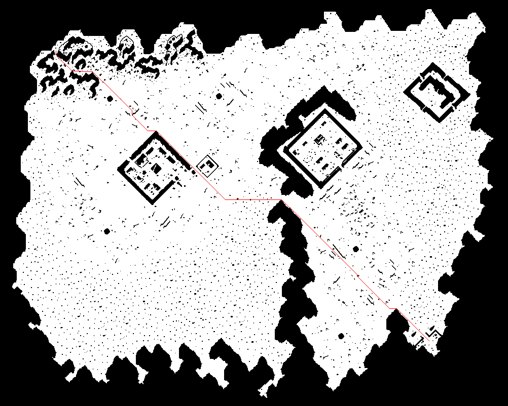

# go-astar

A*寻路算法

引入包：
```go
"github.com/lsq51201314/go-astar"
```

新建寻路
```go
a := astar.NewAstar(1002, 802)
```

设置数据
```go
data, err := ioutil.ReadFile("./test.map")
if err != nil {
	panic(err)
}
a.SetData(data)
```

获取路径
```go
a.Find(110, 100, 846, 674)
fmt.Println(len(a.GetPath()))
```

验证点
```go
fmt.Println(a.CheckPoint(0, 0))
fmt.Println(a.CheckPoint(110, 100))
```

测试结果
